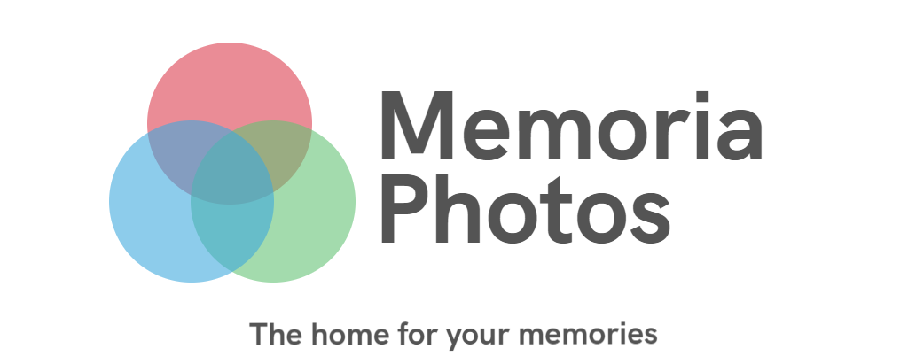

<p align="center">
  
</p>

## Description
Securely back-up your photos and videos to your own servers and enjoy them from anywhere.

## Why try it out?

* :left_right_arrow: **Automatic Sync:** You can store your photos and videos on a server of your choosing.

* 🙌 **All your photos, on all your devices:** Access every photo and video in your library — from any device, anytime you want.

* 🔒 **Designed to keep your photos private:** with our encryption mechanisms & JWT Authorization.

## Upcoming Features

* 🔒 **Accessibility:** Access your photos and videos directly from the browser.

* 📸 **No Limitations:** Upcoming Support for more media types — Live Photos, Portaits & Slow Motion

## Development Setup

1. Ensure you have a Memoria-Core running on an internet accessible server
* 💻 [Install Core Service](https://github.com/sagar5534/Memoria-Core)

2. Bring up the app

  ```bash
  npm i && npm run start
  ```

## Join the team 👪

There are many ways to contribute, of which development is only one! Find out [how to get involved](https://discord.gg/zTN6hEPH9u), including designers, testers, helping others and much more!

## Contact us

If you want to contact us, e.g. before starting a more complex feature, for questions
you can join us at the links below: http

* [💬 Join the Discord](https://discord.gg/zTN6hEPH9u)


## :scroll: License

Memoria is [GPL-3.0](LICENSE) Licensed.